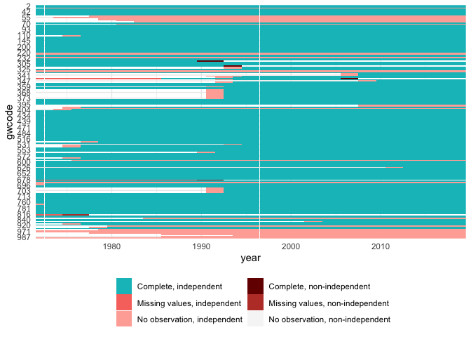

Combine data
================

  - [NOTES FOR DATA UPDATES](#notes-for-data-updates)
  - [Pieces](#pieces)
      - [Master statelist](#master-statelist)
      - [V-Dem DVs](#v-dem-dvs)
      - [V-Dem IVs](#v-dem-ivs)
      - [State age](#state-age)
      - [Population](#population)
      - [Infant mortality](#infant-mortality)
      - [GDP](#gdp)
      - [EPR](#epr)
      - [P\&T Coups](#pt-coups)
      - [ACD](#acd)
      - [Archigos leader info](#archigos-leader-info)
  - [Summarize and write final
    output](#summarize-and-write-final-output)
      - [Record missing cases](#record-missing-cases)
      - [Missing values by column](#missing-values-by-column)

## NOTES FOR DATA UPDATES

END\_YEAR denotes the last year data have been observed. I.e. usually it
should be the year prior to the current year.

Data after this year will be discarded. E.g. to forecast 2020-2021 we
don’t want to use data after 2019 since it likely won’t be
available/incomplete at the time we are making the 2020-2021 forecasts.
Conversely, if the data end early, e.g. in 2017, they will be lagged
additionally so that they reach and cover the target year.

Note also that the DV data are in a 2-year lead. So the data point for
“dv\_v2x\_veracc\_osp\_down\_next2” in 2019 refers to vertical
accountability decreases in 2020-2021.

Several of the data sources below are imputed in some fashion after
merging. E.g. if a data set has to be lagged 1 year to obtain values for
the desired data end year, values for the first of independence for
several states will become missing. When data are updated, these
source-specific lags may change. Thus what cases are missing will
change, and what does or does not get imputed will change. Check the
output of all chunks below for new changes in missing case sets\!

``` r
END_YEAR <- 2019
```

## Pieces

### Master statelist

``` r
cy <- read_csv("../trafo-data/country_year_set_1968_on.csv") %>%
  filter(year > 1969, year <= END_YEAR)
```

    ## Parsed with column specification:
    ## cols(
    ##   gwcode = col_double(),
    ##   year = col_double(),
    ##   country_name = col_character(),
    ##   country_id = col_double(),
    ##   country_text_id = col_character()
    ## )

``` r
cy_names <- cy
cy <- cy[, c("gwcode", "year")]
```

For spatial lagging, we cannot have overlapping geometries. For example
in 1990 we cannot have both re-unified Germany from the end of the year,
and then also separate West Germany and East Germany at the beginning of
the year. Check against state panel to remove cases like this if needed.

``` r
master <- state_panel(1970, END_YEAR, partial = "last", by = "year")
overlap <- compare(master, cy)
report(overlap)
```

    ## 8999 total rows
    ## 8996 rows in df1
    ## 7852 rows in df2
    ## 
    ## 7849 rows match and have no missing values
    ## 2-1970, 2-1971, 2-1972, 2-1973, 2-1974, 2-1975, 2-1976, 2-1977, 2-1978, 2-1979, and 7839 more
    ## 
    ## 1147 rows in df1 (no missing values) but not df2
    ## 31-1973, 31-1974, 31-1975, 31-1976, 31-1977, 31-1978, 31-1979, 31-1980, 31-1981, 31-1982, and 1137 more
    ## 
    ## 3 rows not in df1 but in df2 (no missing values)
    ## 265-1990, 680-1990, 817-1975

``` r
drop <- anti_join(cy, master)
```

    ## Joining, by = c("gwcode", "year")

``` r
drop$drop <- TRUE
cy <- left_join(cy, drop) %>%
  mutate(drop = ifelse(is.na(drop), FALSE, drop))
```

    ## Joining, by = c("gwcode", "year")

``` r
cy <- cy[!cy$drop, ]
cy$drop <- NULL
```

``` r
plotmiss(cy)
```

<!-- -->

### V-Dem DVs

These are the indicators from which the outcome variables are derived.

``` r
dv <- read_csv("../trafo-data/dv_data_1968_on.csv") %>%
  select(-country_name, -country_id, -country_text_id) %>%
  filter(complete.cases(.)) %>%
  arrange(gwcode, year)
```

    ## Parsed with column specification:
    ## cols(
    ##   gwcode = col_double(),
    ##   year = col_double(),
    ##   country_name = col_character(),
    ##   country_id = col_double(),
    ##   country_text_id = col_character(),
    ##   v2x_veracc_osp = col_double(),
    ##   v2xcs_ccsi = col_double(),
    ##   v2xcl_rol = col_double(),
    ##   v2x_freexp_altinf = col_double(),
    ##   v2x_horacc_osp = col_double(),
    ##   v2x_pubcorr = col_double()
    ## )

``` r
range(dv$year)
```

    ## [1] 1968 2019

``` r
dv_data <- read_rds("../trafo-data/dv-data.rds")
cy <- left_join(cy, dv_data, by = c("gwcode", "year"))
```

For outcome variable *x*, this code creates the following additional
columns:

  - `[x]`: the raw outcome variable
  - `[x]_diff_y2y`: the year to year change
  - `dv_[x]_...`: versions starting with “dv\_” should not be used as
    IVs
      - `dv_[x]_change`: character vector of the current year change
        (up, same, down)
      - `dv_[x]_[up, down]_next2`: 0/1 indicator, is there a up/down
        change in the next 2 years?

<!-- end list -->

``` r
plotmiss(cy)
```

<!-- -->

The missing are because the “next2” variables are missing for the last 2
years of available data since we don’t have the 2 years of future
outcomes yet.

### V-Dem IVs

``` r
vdem_dat <- read_csv("../trafo-data/vdem_data_1968_on.csv") %>%
  select(-country_name, -country_id, -country_text_id) %>%
  filter(complete.cases(.)) %>%
  arrange(gwcode, year)
```

    ## Parsed with column specification:
    ## cols(
    ##   .default = col_double(),
    ##   country_name = col_character(),
    ##   country_text_id = col_character()
    ## )

    ## See spec(...) for full column specifications.

``` r
# take out zero-variance vars
sds <- sapply(vdem_dat, sd)
zv_vars <- names(sds[sds==0])
vdem_dat <- vdem_dat %>% select(-one_of(zv_vars))

names(vdem_dat) <- stringr::str_replace(names(vdem_dat), "^lagged\\_", "")

# check no DVs are here
if (any(setdiff(names(vdem_dat), c("gwcode", "year")) %in% names(dv))) {
  stop("Some DV variables are in V-Dem IV set, staaap")
}

vdem_dat <- vdem_dat %>%
  filter(year <= END_YEAR)
vdem_lag <- END_YEAR - max(vdem_dat$year)
vdem_dat <- vdem_dat %>%
  mutate(year = year + vdem_lag) %>%
  setNames(c(names(.)[1:2], paste0("lag", vdem_lag, "_", names(.)[-c(1:2)])))

vdem_lag
```

    ## [1] 0

``` r
str(vdem_dat)
```

    ## Classes 'spec_tbl_df', 'tbl_df', 'tbl' and 'data.frame': 8120 obs. of  367 variables:
    ##  $ gwcode                                : num  2 2 2 2 2 2 2 2 2 2 ...
    ##  $ year                                  : num  1968 1969 1970 1971 1972 ...
    ##  $ lag0_is_leg                           : num  1 1 1 1 1 1 1 1 1 1 ...
    ##  $ lag0_is_elec                          : num  1 1 1 1 1 1 1 1 1 1 ...
    ##  $ lag0_is_election_year                 : num  1 0 1 0 1 0 1 0 1 0 ...
    ##  $ lag0_v2x_polyarchy                    : num  0.694 0.671 0.695 0.741 0.744 0.746 0.754 0.787 0.79 0.845 ...
    ##  $ lag0_v2x_liberal                      : num  0.861 0.881 0.896 0.899 0.9 0.92 0.938 0.931 0.932 0.937 ...
    ##  $ lag0_v2xdl_delib                      : num  0.896 0.906 0.906 0.906 0.906 0.913 0.913 0.941 0.944 0.962 ...
    ##  $ lag0_v2x_jucon                        : num  0.861 0.915 0.932 0.932 0.932 0.932 0.93 0.931 0.935 0.935 ...
    ##  $ lag0_v2x_frassoc_thick                : num  0.857 0.845 0.848 0.877 0.875 0.896 0.894 0.884 0.884 0.925 ...
    ##  $ lag0_v2xel_frefair                    : num  0.768 0.727 0.734 0.801 0.796 0.771 0.774 0.834 0.837 0.852 ...
    ##  $ lag0_v2x_elecoff                      : num  1 1 1 1 1 1 1 1 1 1 ...
    ##  $ lag0_v2xlg_legcon                     : num  0.876 0.876 0.887 0.887 0.887 0.955 0.955 0.955 0.945 0.94 ...
    ##  $ lag0_v2x_partip                       : num  0.634 0.634 0.64 0.64 0.64 0.643 0.643 0.651 0.65 0.65 ...
    ##  $ lag0_v2x_cspart                       : num  0.89 0.89 0.93 0.93 0.93 0.953 0.953 0.937 0.961 0.961 ...
    ##  $ lag0_v2x_egal                         : num  0.632 0.666 0.752 0.762 0.798 0.761 0.761 0.763 0.803 0.759 ...
    ##  $ lag0_v2xeg_eqprotec                   : num  0.661 0.799 0.845 0.845 0.845 0.845 0.845 0.845 0.845 0.825 ...
    ##  $ lag0_v2xeg_eqaccess                   : num  0.607 0.588 0.757 0.757 0.792 0.749 0.749 0.776 0.729 0.729 ...
    ##  $ lag0_v2xeg_eqdr                       : num  0.554 0.574 0.681 0.682 0.682 0.658 0.658 0.658 0.677 0.677 ...
    ##  $ lag0_v2x_diagacc                      : num  1.25 1.33 1.46 1.42 1.47 ...
    ##  $ lag0_v2xex_elecleg                    : num  1 1 1 1 1 1 1 1 1 1 ...
    ##  $ lag0_v2x_civlib                       : num  0.824 0.861 0.899 0.897 0.906 0.911 0.911 0.913 0.916 0.911 ...
    ##  $ lag0_v2x_clphy                        : num  0.842 0.852 0.868 0.868 0.883 0.883 0.883 0.883 0.883 0.883 ...
    ##  $ lag0_v2x_clpol                        : num  0.9 0.905 0.919 0.901 0.92 0.938 0.947 0.948 0.949 0.955 ...
    ##  $ lag0_v2x_clpriv                       : num  0.799 0.854 0.904 0.909 0.909 0.909 0.909 0.918 0.913 0.915 ...
    ##  $ lag0_v2x_corr                         : num  0.067 0.076 0.081 0.075 0.075 0.075 0.075 0.058 0.058 0.058 ...
    ##  $ lag0_v2x_EDcomp_thick                 : num  0.745 0.738 0.748 0.815 0.809 0.805 0.805 0.819 0.821 0.875 ...
    ##  $ lag0_v2x_elecreg                      : num  1 1 1 1 1 1 1 1 1 1 ...
    ##  $ lag0_v2x_freexp                       : num  0.882 0.9 0.916 0.882 0.91 0.926 0.95 0.948 0.959 0.952 ...
    ##  $ lag0_v2x_gencl                        : num  0.726 0.825 0.844 0.855 0.855 0.855 0.855 0.879 0.885 0.885 ...
    ##  $ lag0_v2x_gencs                        : num  0.449 0.52 0.619 0.635 0.585 0.622 0.68 0.743 0.743 0.743 ...
    ##  $ lag0_v2x_hosabort                     : num  0 0 0 0 0 0 0 0 0 0 ...
    ##  $ lag0_v2x_hosinter                     : num  0 0 0 0 0 0 0 0 0 0 ...
    ##  $ lag0_v2x_rule                         : num  0.94 0.946 0.951 0.956 0.946 0.963 0.964 0.972 0.975 0.975 ...
    ##  $ lag0_v2xcl_acjst                      : num  0.811 0.913 0.936 0.936 0.95 0.95 0.95 0.95 0.95 0.95 ...
    ##  $ lag0_v2xcl_disc                       : num  0.807 0.885 0.883 0.894 0.894 0.894 0.941 0.949 0.949 0.949 ...
    ##  $ lag0_v2xcl_dmove                      : num  0.644 0.767 0.843 0.843 0.843 0.843 0.843 0.878 0.878 0.878 ...
    ##  $ lag0_v2xcl_prpty                      : num  0.579 0.649 0.686 0.742 0.742 0.742 0.742 0.742 0.833 0.833 ...
    ##  $ lag0_v2xcl_slave                      : num  0.748 0.748 0.745 0.769 0.769 0.769 0.769 0.769 0.769 0.769 ...
    ##  $ lag0_v2xel_elecparl                   : num  1 0 1 0 1 0 1 0 1 0 ...
    ##  $ lag0_v2xel_elecpres                   : num  1 0 0 0 1 0 0 0 1 0 ...
    ##  $ lag0_v2xex_elecreg                    : num  1 1 1 1 1 1 1 1 1 1 ...
    ##  $ lag0_v2xlg_elecreg                    : num  1 1 1 1 1 1 1 1 1 1 ...
    ##  $ lag0_v2ex_legconhog                   : num  0 0 0 0 0 0 0 0 0 0 ...
    ##  $ lag0_v2ex_legconhos                   : num  0 0 0 0 0 0 1 1 1 0 ...
    ##  $ lag0_v2x_ex_confidence                : num  0 0 0 0 0 0 0 0 0 0 ...
    ##  $ lag0_v2x_ex_direlect                  : num  1 1 1 1 1 1 0 0 0 1 ...
    ##  $ lag0_v2x_ex_hereditary                : num  0.05 0.05 0.05 0.05 0.05 0.05 0.05 0.05 0.05 0.05 ...
    ##  $ lag0_v2x_ex_military                  : num  0 0 0 0 0 0 0 0 0 0 ...
    ##  $ lag0_v2x_ex_party                     : num  0.05 0.05 0.05 0.05 0.05 0.05 0.05 0.05 0.05 0.05 ...
    ##  $ lag0_v2x_execorr                      : num  0.04 0.065 0.105 0.105 0.105 0.105 0.105 0.042 0.042 0.042 ...
    ##  $ lag0_v2x_legabort                     : num  0 0 0 0 0 0 0 0 0 0 ...
    ##  $ lag0_v2xlg_leginter                   : num  0 0 0 0 0 0 0 0 0 0 ...
    ##  $ lag0_v2x_neopat                       : num  0.098 0.097 0.096 0.086 0.086 0.079 0.078 0.054 0.054 0.056 ...
    ##  $ lag0_v2xnp_client                     : num  0.235 0.234 0.234 0.195 0.201 0.236 0.235 0.227 0.221 0.188 ...
    ##  $ lag0_v2xnp_pres                       : num  0.107 0.117 0.082 0.082 0.082 0.066 0.066 0.044 0.049 0.05 ...
    ##  $ lag0_v2xnp_regcorr                    : num  0.051 0.072 0.095 0.095 0.095 0.095 0.095 0.05 0.05 0.05 ...
    ##  $ lag0_v2elvotbuy                       : num  0.201 0.201 0.98 0.98 0.962 ...
    ##  $ lag0_v2elfrcamp                       : num  0.534 0.534 0.525 0.525 0.551 0.551 0.584 0.584 0.586 0.586 ...
    ##  $ lag0_v2elpdcamp                       : num  1.82 1.82 1.83 1.83 1.81 ...
    ##  $ lag0_v2elpaidig                       : num  2.21 2.21 2.24 2.24 2.22 ...
    ##  $ lag0_v2elmonref                       : num  0 0 0 0 0 0 0 0 0 0 ...
    ##  $ lag0_v2elmonden                       : num  0 0 0 0 0 0 0 0 0 0 ...
    ##  $ lag0_v2elrgstry                       : num  0.121 0.121 0.381 0.381 0.391 0.391 0.397 0.397 0.369 0.369 ...
    ##  $ lag0_v2elirreg                        : num  0.824 0.824 0.826 0.826 0.813 0.813 0.83 0.83 1.25 1.25 ...
    ##  $ lag0_v2elintim                        : num  1.1 1.1 1.23 1.23 1.38 ...
    ##  $ lag0_v2elpeace                        : num  0.3 0.3 1.09 1.09 1.18 ...
    ##  $ lag0_v2elfrfair                       : num  0.906 0.906 0.899 0.899 0.754 ...
    ##  $ lag0_v2elmulpar                       : num  1.55 1.55 1.59 1.59 1.58 ...
    ##  $ lag0_v2elboycot                       : num  1.27 1.27 1.31 1.31 1.26 ...
    ##  $ lag0_v2elaccept                       : num  1.41 1.41 1.43 1.43 1.44 ...
    ##  $ lag0_v2elasmoff                       : num  0.562 0.562 0.521 0.521 0.576 0.576 0.52 0.52 0.506 0.506 ...
    ##  $ lag0_v2eldonate                       : num  2.36 2.36 2.56 2.62 2.62 ...
    ##  $ lag0_v2elpubfin                       : num  -1.9 -1.9 -1.9 -0.985 -0.985 -0.705 -0.538 -0.538 0.522 0.522 ...
    ##  $ lag0_v2ellocumul                      : num  35 35 36 36 37 37 38 38 39 39 ...
    ##  $ lag0_v2elprescons                     : num  18 18 18 18 19 19 19 19 20 20 ...
    ##  $ lag0_v2elprescumul                    : num  18 18 18 18 19 19 19 19 20 20 ...
    ##  $ lag0_v2elembaut                       : num  1.22 1.22 1.65 1.65 1.65 ...
    ##  $ lag0_v2elembcap                       : num  0.653 0.653 0.653 0.653 0.653 0.653 0.653 0.867 0.867 0.867 ...
    ##  $ lag0_v2elreggov                       : num  1 1 1 1 1 1 1 1 1 1 ...
    ##  $ lag0_v2ellocgov                       : num  1 1 1 1 1 1 1 1 1 1 ...
    ##  $ lag0_v2ellocons                       : num  35 35 36 36 37 37 38 38 39 39 ...
    ##  $ lag0_v2elrsthos                       : num  1 1 1 1 1 1 1 1 1 1 ...
    ##  $ lag0_v2elrstrct                       : num  1 1 1 1 1 1 1 1 1 1 ...
    ##  $ lag0_v2psparban                       : num  0.755 0.755 0.755 0.755 0.755 ...
    ##  $ lag0_v2psbars                         : num  1.78 1.78 1.78 1.78 1.78 ...
    ##  $ lag0_v2psoppaut                       : num  2.93 2.93 2.93 2.93 2.93 ...
    ##  $ lag0_v2psorgs                         : num  1.95 1.95 1.95 1.95 1.95 ...
    ##  $ lag0_v2psprbrch                       : num  2.01 2.01 2.01 2.01 2.01 ...
    ##  $ lag0_v2psprlnks                       : num  1.24 1.24 1.24 1.24 1.24 ...
    ##  $ lag0_v2psplats                        : num  2.65 2.65 2.65 2.65 2.65 ...
    ##  $ lag0_v2pscnslnl                       : num  3.06 3.06 3.63 3.63 3.63 ...
    ##  $ lag0_v2pscohesv                       : num  -0.866 -0.866 -0.866 -0.866 -0.866 -0.866 -0.866 -0.866 -0.866 -0.866 ...
    ##  $ lag0_v2pscomprg                       : num  0.976 0.976 0.976 0.976 0.976 0.976 0.976 0.976 0.976 0.976 ...
    ##  $ lag0_v2psnatpar                       : num  2.479 0.115 0.005 0.005 0.005 ...
    ##  $ lag0_v2pssunpar                       : num  1.48 1.48 1.48 1.48 1.48 ...
    ##  $ lag0_v2exremhsp                       : num  -0.498 -0.498 -0.498 -0.498 -0.498 -0.498 -0.498 -0.498 -0.498 -0.498 ...
    ##  $ lag0_v2exdfdshs                       : num  -2.96 -2.96 -2.96 -2.96 -2.96 -2.96 -2.96 -2.96 -2.96 -2.96 ...
    ##  $ lag0_v2exdfcbhs                       : num  0.003 0.003 0.003 0.003 0.003 0.003 0.003 0.003 0.003 0.003 ...
    ##   [list output truncated]

``` r
plotmiss(vdem_dat)
```

<!-- -->

There are a couple of new missing country-years from tails (GDR, South
Vietnam); fill those in with carry forward.

``` r
cy <- left_join(cy, vdem_dat, by = c("gwcode", "year")) %>%
  arrange(gwcode, year) %>%
  tidyr::fill(one_of(names(vdem_dat)), .direction = "down")
```

### State age

``` r
age_dat <- read_csv("../input/gwstate-age.csv") %>%
  filter(year <= END_YEAR) %>%
  mutate(log_state_age = log(state_age))
```

    ## Parsed with column specification:
    ## cols(
    ##   gwcode = col_double(),
    ##   year = col_double(),
    ##   state_age = col_double()
    ## )

``` r
age_lag <- END_YEAR - max(age_dat$year)
age_dat <- age_dat %>%
  mutate(year = year + age_lag) %>%
  setNames(c(names(.)[1:2], paste0("lag", age_lag, "_", names(.)[-c(1:2)])))

age_lag
```

    ## [1] 0

``` r
str(age_dat)
```

    ## Classes 'spec_tbl_df', 'tbl_df', 'tbl' and 'data.frame': 19667 obs. of  4 variables:
    ##  $ gwcode            : num  2 2 2 2 2 2 2 2 2 2 ...
    ##  $ year              : num  1816 1817 1818 1819 1820 ...
    ##  $ lag0_state_age    : num  1 2 3 4 5 6 7 8 9 10 ...
    ##  $ lag0_log_state_age: num  0 0.693 1.099 1.386 1.609 ...

``` r
plotmiss(age_dat)
```

<!-- -->

All states in their last year of existence. Add 1 to previous state age.

``` r
cy <- left_join(cy, age_dat, by = c("gwcode", "year")) %>%
  arrange(gwcode, year) %>%
  group_by(gwcode) %>%
  mutate(lag0_state_age = case_when(
    is.na(lag0_state_age) ~ tail(lag(lag0_state_age, 1), 1) + 1L,
    TRUE ~ lag0_state_age
  ),
  lag0_log_state_age = log(lag0_state_age)) %>%
  ungroup()
```

### Population

``` r
pop_dat <- read_csv("../input/population.csv") %>%
  filter(year <= END_YEAR) %>%
  mutate(log_pop = log(pop))
```

    ## Parsed with column specification:
    ## cols(
    ##   gwcode = col_double(),
    ##   year = col_double(),
    ##   pop = col_double()
    ## )

``` r
pop_lag <- END_YEAR - max(pop_dat$year)
pop_dat <- pop_dat %>%
  mutate(year = year + pop_lag) %>%
  setNames(c(names(.)[1:2], paste0("lag", pop_lag, "_", names(pop_dat)[-c(1:2)])))

pop_lag
```

    ## [1] 0

``` r
str(pop_dat)
```

    ## Classes 'spec_tbl_df', 'tbl_df', 'tbl' and 'data.frame': 11202 obs. of  4 variables:
    ##  $ gwcode      : num  2 2 2 2 2 2 2 2 2 2 ...
    ##  $ year        : num  1950 1951 1952 1953 1954 ...
    ##  $ lag0_pop    : num  158804 160905 163325 165988 168828 ...
    ##  $ lag0_log_pop: num  12 12 12 12 12 ...

``` r
plotmiss(pop_dat)
```

<!-- -->

Check missing cases.

``` r
cy_temp <- left_join(cy, pop_dat, by = c("gwcode", "year"))
tbl <- filter(cy_temp, is.na(lag0_pop)) %>% select(gwcode, year, lag0_pop)
tbl
```

    ## # A tibble: 0 x 3
    ## # … with 3 variables: gwcode <dbl>, year <dbl>, lag0_pop <dbl>

No missing cases.

``` r
if (nrow(tbl) > 0) {
  stop("Something has changed")
}

cy <- left_join(cy, pop_dat, by = c("gwcode", "year")) %>%
  arrange(gwcode, year) %>%
  tidyr::fill(contains("_pop"), .direction = "down")
```

``` r
plotmiss(pop_dat)
```

<!-- -->

### Infant mortality

``` r
infmort <- read_csv("../input/wdi-infmort-v2.csv") %>%
  filter(year <= END_YEAR) 
```

    ## Parsed with column specification:
    ## cols(
    ##   gwcode = col_double(),
    ##   year = col_double(),
    ##   infmort = col_double()
    ## )

``` r
infmort_lag <- END_YEAR - max(infmort$year)
infmort <- infmort %>%
  mutate(year = year + infmort_lag) %>%
  setNames(c(names(.)[1:2], paste0("lag", infmort_lag, "_", names(infmort)[-c(1:2)])))

infmort_lag
```

    ## [1] 2

``` r
str(infmort)
```

    ## Classes 'spec_tbl_df', 'tbl_df', 'tbl' and 'data.frame': 7512 obs. of  3 variables:
    ##  $ gwcode      : num  2 2 2 2 2 2 2 2 2 2 ...
    ##  $ year        : num  1972 1973 1974 1975 1976 ...
    ##  $ lag2_infmort: num  19.9 19.1 18.3 17.5 16.7 15.9 15.2 14.5 13.8 13.2 ...

Check missing cases.

``` r
cy_temp <- left_join(cy, infmort, by = c("gwcode", "year"))
tbl <- filter(cy_temp, is.na(lag2_infmort)) %>% select(gwcode, year, lag2_infmort)
tbl
```

    ## # A tibble: 385 x 3
    ##    gwcode  year lag2_infmort
    ##     <dbl> <dbl>        <dbl>
    ##  1      2  1970           NA
    ##  2      2  1971           NA
    ##  3     20  1970           NA
    ##  4     20  1971           NA
    ##  5     40  1970           NA
    ##  6     40  1971           NA
    ##  7     41  1970           NA
    ##  8     41  1971           NA
    ##  9     42  1970           NA
    ## 10     42  1971           NA
    ## # … with 375 more rows

``` r
plotmiss(infmort)
```

<!-- -->

``` r
cy <- left_join(cy, infmort, by = c("gwcode", "year")) %>%
  arrange(gwcode, year) %>%
  tidyr::fill(contains("_infmort"), .direction = "up")
```

### GDP

``` r
gdp_dat <- read_csv("../input/gdp_1950_2017.csv") %>%
  select(-date) %>%
  filter(year <= END_YEAR) %>%
  dplyr::rename(gdp = NY.GDP.MKTP.KD,
                gdp_growth = NY.GDP.MKTP.KD.ZG,
                gdp_pc = NY.GDP.PCAP.KD,
                gdp_pc_growth = NY.GDP.PCAP.KD.ZG) %>%
  mutate(log_gdp = log(gdp),
         gdp = NULL,
         log_gdp_pc = log(gdp_pc),
         gdp_pc = NULL)
```

    ## Parsed with column specification:
    ## cols(
    ##   gwcode = col_double(),
    ##   year = col_double(),
    ##   NY.GDP.MKTP.KD = col_double(),
    ##   NY.GDP.MKTP.KD.ZG = col_double(),
    ##   NY.GDP.PCAP.KD = col_double(),
    ##   NY.GDP.PCAP.KD.ZG = col_double(),
    ##   date = col_date(format = "")
    ## )

``` r
gdp_lag <- END_YEAR - max(gdp_dat$year)
gdp_dat <- gdp_dat %>%
  mutate(year = year + gdp_lag) %>%
  setNames(c(names(.)[1:2], paste0("lag", gdp_lag, "_", names(gdp_dat)[-c(1:2)])))


gdp_lag
```

    ## [1] 2

``` r
str(gdp_dat)
```

    ## Classes 'spec_tbl_df', 'tbl_df', 'tbl' and 'data.frame': 10809 obs. of  6 variables:
    ##  $ gwcode            : num  2 20 40 41 42 70 90 91 92 93 ...
    ##  $ year              : num  1952 1952 1952 1952 1952 ...
    ##  $ lag2_gdp_growth   : num  3.956 3.791 0.897 1.12 0 ...
    ##  $ lag2_gdp_pc_growth: num  0 1.394 0.234 1.078 0 ...
    ##  $ lag2_log_gdp      : num  28.4 26 23.4 22 21.5 ...
    ##  $ lag2_log_gdp_pc   : num  9.51 9.56 7.77 6.99 6.78 ...

``` r
plotmiss(gdp_dat)
```

<!-- -->

Missing some first years due to lagging; fill them with first observed
value.

``` r
cy <- left_join(cy, gdp_dat, by = c("gwcode", "year")) %>%
  arrange(gwcode, year) %>%
  tidyr::fill(contains("_gdp"), .direction = "up")
```

### EPR

``` r
epr_dat <- read_csv("../input/epr-yearly.csv") %>%
  select(-date) %>%
  filter(year <= END_YEAR)
```

    ## Parsed with column specification:
    ## cols(
    ##   gwcode = col_double(),
    ##   date = col_date(format = ""),
    ##   year = col_double(),
    ##   epr_groups = col_double(),
    ##   epr_elf = col_double(),
    ##   epr_excluded_groups_count = col_double(),
    ##   epr_excluded_group_pop = col_double(),
    ##   epr_inpower_groups_count = col_double(),
    ##   epr_inpower_groups_pop = col_double(),
    ##   epr_regaut_groups_count = col_double(),
    ##   epr_regaut_group_pop = col_double()
    ## )

``` r
epr_lag <- END_YEAR - max(epr_dat$year)
epr_dat <- epr_dat %>%
  mutate(year = year + epr_lag) %>%
  setNames(c(names(.)[1:2], paste0("lag", epr_lag, "_", names(epr_dat)[-c(1:2)])))


epr_lag
```

    ## [1] 2

``` r
str(epr_dat)
```

    ## Classes 'spec_tbl_df', 'tbl_df', 'tbl' and 'data.frame': 11128 obs. of  10 variables:
    ##  $ gwcode                        : num  2 20 40 41 42 70 90 91 92 93 ...
    ##  $ year                          : num  1948 1948 1948 1948 1948 ...
    ##  $ lag2_epr_groups               : num  6 3 2 1 1 4 4 3 2 4 ...
    ##  $ lag2_epr_elf                  : num  0.51 0.427 0.54 1 1 ...
    ##  $ lag2_epr_excluded_groups_count: num  2 1 1 0 0 3 1 1 1 3 ...
    ##  $ lag2_epr_excluded_group_pop   : num  0.132 0.02 0.359 0 0 ...
    ##  $ lag2_epr_inpower_groups_count : num  4 2 1 1 1 1 3 2 1 1 ...
    ##  $ lag2_epr_inpower_groups_pop   : num  0.856 0.87 0.641 1 1 ...
    ##  $ lag2_epr_regaut_groups_count  : num  1 2 0 0 0 0 0 0 0 0 ...
    ##  $ lag2_epr_regaut_group_pop     : num  0.0078 0.87 0 0 0 0 0 0 0 0 ...

``` r
plotmiss(epr_dat)
```

<!-- -->

Missing some first years due to lagging; fill them with first observed
value.

``` r
cy <- left_join(cy, epr_dat, by = c("gwcode", "year")) %>%
  arrange(gwcode, year) %>%
  tidyr::fill(contains("_epr_"), .direction = "up")
```

### P\&T Coups

``` r
coup_dat <- read_csv("../input/ptcoups.csv") %>%
  filter(year <= END_YEAR)
```

    ## Parsed with column specification:
    ## cols(
    ##   .default = col_double()
    ## )

    ## See spec(...) for full column specifications.

``` r
coup_lag <- END_YEAR - max(coup_dat$year)
coup_dat <- coup_dat %>%
  mutate(year = year + coup_lag) %>%
  setNames(c(names(.)[1:2], paste0("lag", coup_lag, "_", names(.)[-c(1:2)])))

coup_lag
```

    ## [1] 0

``` r
str(coup_dat)
```

    ## Classes 'spec_tbl_df', 'tbl_df', 'tbl' and 'data.frame': 11202 obs. of  20 variables:
    ##  $ gwcode                          : num  2 2 2 2 2 2 2 2 2 2 ...
    ##  $ year                            : num  1950 1951 1952 1953 1954 ...
    ##  $ lag0_pt_attempt                 : num  0 0 0 0 0 0 0 0 0 0 ...
    ##  $ lag0_pt_attempt_num             : num  0 0 0 0 0 0 0 0 0 0 ...
    ##  $ lag0_pt_coup_num                : num  0 0 0 0 0 0 0 0 0 0 ...
    ##  $ lag0_pt_coup                    : num  0 0 0 0 0 0 0 0 0 0 ...
    ##  $ lag0_pt_failed_num              : num  0 0 0 0 0 0 0 0 0 0 ...
    ##  $ lag0_pt_failed                  : num  0 0 0 0 0 0 0 0 0 0 ...
    ##  $ lag0_pt_coup_total              : num  0 0 0 0 0 0 0 0 0 0 ...
    ##  $ lag0_pt_failed_total            : num  0 0 0 0 0 0 0 0 0 0 ...
    ##  $ lag0_pt_attempt_total           : num  0 0 0 0 0 0 0 0 0 0 ...
    ##  $ lag0_pt_coup_num5yrs            : num  0 0 0 0 0 0 0 0 0 0 ...
    ##  $ lag0_pt_failed_num5yrs          : num  0 0 0 0 0 0 0 0 0 0 ...
    ##  $ lag0_pt_attempt_num5yrs         : num  0 0 0 0 0 0 0 0 0 0 ...
    ##  $ lag0_pt_coup_num10yrs           : num  0 0 0 0 0 0 0 0 0 0 ...
    ##  $ lag0_pt_failed_num10yrs         : num  0 0 0 0 0 0 0 0 0 0 ...
    ##  $ lag0_pt_attempt_num10yrs        : num  0 0 0 0 0 0 0 0 0 0 ...
    ##  $ lag0_years_since_last_pt_coup   : num  1 2 3 4 5 6 7 8 9 10 ...
    ##  $ lag0_years_since_last_pt_failed : num  1 2 3 4 5 6 7 8 9 10 ...
    ##  $ lag0_years_since_last_pt_attempt: num  1 2 3 4 5 6 7 8 9 10 ...

``` r
plotmiss(coup_dat)
```

<!-- -->

Missing some first years due to lagging; fill them with first observed
value.

``` r
cy_temp <- left_join(cy, coup_dat, by = c("gwcode", "year")) 
tbl <- filter(cy_temp, is.na(lag0_pt_coup)) %>% select(gwcode, year)
tbl
```

    ## # A tibble: 0 x 2
    ## # … with 2 variables: gwcode <dbl>, year <dbl>

No missing cases.

``` r
if (nrow(tbl) > 0) {
  stop("Something has changed")
}

cy <- left_join(cy, coup_dat, by = c("gwcode", "year")) %>%
  arrange(gwcode, year) %>%
  tidyr::fill(contains("_pt_coup"), contains("_pt_failed_coup"), .direction = "down")
```

### ACD

``` r
acd_dat <- read_csv("../input/acd.csv") %>%
  filter(year <= END_YEAR) %>%
  select(gwcode, year, everything())
```

    ## Parsed with column specification:
    ## cols(
    ##   gwcode = col_double(),
    ##   internal_confl = col_double(),
    ##   internal_confl_major = col_double(),
    ##   internal_confl_minor = col_double(),
    ##   internal_confl_part = col_double(),
    ##   internal_confl_part_major = col_double(),
    ##   internal_confl_part_minor = col_double(),
    ##   war = col_double(),
    ##   war_major = col_double(),
    ##   war_minor = col_double(),
    ##   any_conflict = col_double(),
    ##   any_conflict_major = col_double(),
    ##   any_conflict_minor = col_double(),
    ##   ext_conf = col_double(),
    ##   ext_conf_major = col_double(),
    ##   ext_conf_minor = col_double(),
    ##   year = col_double()
    ## )

``` r
acd_lag <- END_YEAR - max(acd_dat$year)
acd_dat <- acd_dat %>%
  mutate(year = year + acd_lag) %>%
  setNames(c(names(.)[1:2], paste0("lag", acd_lag, "_", names(.)[-c(1:2)])))

acd_lag
```

    ## [1] 1

``` r
str(acd_dat)
```

    ## Classes 'spec_tbl_df', 'tbl_df', 'tbl' and 'data.frame': 11325 obs. of  17 variables:
    ##  $ gwcode                        : num  2 2 2 2 2 2 2 2 2 2 ...
    ##  $ year                          : num  1947 1948 1949 1950 1951 ...
    ##  $ lag1_internal_confl           : num  0 0 0 0 1 0 0 0 0 0 ...
    ##  $ lag1_internal_confl_major     : num  0 0 0 0 0 0 0 0 0 0 ...
    ##  $ lag1_internal_confl_minor     : num  0 0 0 0 1 0 0 0 0 0 ...
    ##  $ lag1_internal_confl_part      : num  0 0 0 0 1 0 0 0 0 0 ...
    ##  $ lag1_internal_confl_part_major: num  0 0 0 0 0 0 0 0 0 0 ...
    ##  $ lag1_internal_confl_part_minor: num  0 0 0 0 1 0 0 0 0 0 ...
    ##  $ lag1_war                      : num  0 0 0 0 1 1 1 1 1 0 ...
    ##  $ lag1_war_major                : num  0 0 0 0 1 1 1 1 1 0 ...
    ##  $ lag1_war_minor                : num  0 0 0 0 0 0 0 0 0 0 ...
    ##  $ lag1_any_conflict             : num  0 0 0 0 1 1 1 1 1 0 ...
    ##  $ lag1_any_conflict_major       : num  0 0 0 0 1 1 1 1 1 0 ...
    ##  $ lag1_any_conflict_minor       : num  0 0 0 0 1 0 0 0 0 0 ...
    ##  $ lag1_ext_conf                 : num  0 0 0 0 1 1 1 1 1 0 ...
    ##  $ lag1_ext_conf_major           : num  0 0 0 0 1 1 1 1 1 0 ...
    ##  $ lag1_ext_conf_minor           : num  0 0 0 0 0 0 0 0 0 0 ...

``` r
plotmiss(acd_dat)
```

<!-- -->

Fill in initial years and check there are no missing values left after
that.

``` r
cy_temp <- left_join(cy, acd_dat, by = c("gwcode", "year")) %>%
  arrange(gwcode, year) %>%
  tidyr::fill(contains("_internal_confl"), contains("_war"), 
              contains("_any_conflict"), contains("_ext_conf"),
              .direction = "up")
tbl <- filter(cy_temp, is.na(lag1_internal_confl)) %>% select(gwcode, year)
tbl
```

    ## # A tibble: 0 x 2
    ## # … with 2 variables: gwcode <dbl>, year <dbl>

All good.

``` r
if (nrow(tbl) > 0) {
  stop("Something has changed")
}

cy <- left_join(cy, acd_dat, by = c("gwcode", "year")) %>%
  arrange(gwcode, year) %>%
  tidyr::fill(contains("_internal_confl"), contains("_war"), 
              contains("_any_conflict"), contains("_ext_conf"),
              .direction = "up")
```

### Archigos leader info

``` r
arch <- read_rds("../input/archigos_cy.rds") %>%
  filter(year <= END_YEAR) 
arch_lag <- END_YEAR - max(arch$year)
arch <- arch %>%
  mutate(year = year + arch_lag) %>%
  setNames(c(names(.)[1:2], paste0("lag", arch_lag, "_", names(arch)[-c(1:2)])))

arch_lag
```

    ## [1] 1

``` r
str(arch)
```

    ## 'data.frame':    18080 obs. of  7 variables:
    ##  $ gwcode              : int  2 2 2 2 2 2 2 2 2 2 ...
    ##  $ year                : num  1841 1842 1843 1844 1845 ...
    ##  $ lag1_ldr_age        : num  NA NA NA NA NA NA NA NA NA NA ...
    ##  $ lag1_ldr_yr_in_power: num  NA NA NA NA NA NA NA NA NA NA ...
    ##  $ lag1_ldr_irr_entry  : int  NA NA NA NA NA NA NA NA NA NA ...
    ##  $ lag1_ldr_male       : int  NA NA NA NA NA NA NA NA NA NA ...
    ##  $ lag1_ldr_imputed    : int  0 0 0 0 0 0 0 0 0 0 ...

Check missing cases.

``` r
cy_temp <- left_join(cy, arch, by = c("gwcode", "year"))
tbl <- filter(cy_temp, is.na(lag1_ldr_age)) %>% select(gwcode, year, lag1_ldr_age)
tbl
```

    ## # A tibble: 40 x 3
    ##    gwcode  year lag1_ldr_age
    ##     <dbl> <dbl>        <dbl>
    ##  1    115  1975           NA
    ##  2    316  1993           NA
    ##  3    317  1993           NA
    ##  4    340  2006           NA
    ##  5    341  2006           NA
    ##  6    343  1991           NA
    ##  7    344  1992           NA
    ##  8    346  1992           NA
    ##  9    347  2008           NA
    ## 10    349  1992           NA
    ## # … with 30 more rows

All are first year of independence.

``` r
arch %>% 
  filter(year > 1968) %>%
  plotmiss(.)
```

<!-- -->

Carry-forward impute any cases that are missing the most recent year.
First year of independence os also missing for several countries.
Carry-back impute. Do this after joining to master list because “arch”
is plain missing those country-year rows.

``` r
cy <- left_join(cy, arch, by = c("gwcode", "year")) %>%
  arrange(gwcode, year) %>%
  tidyr::fill(contains("_ldr"), .direction = "down") %>%
  # carry-back impute missing in first year of independence
  tidyr::fill(contains("_ldr"), .direction = "up") 
```

## Summarize and write final output

``` r
str(cy)
```

    ## Classes 'tbl_df', 'tbl' and 'data.frame':    7849 obs. of  482 variables:
    ##  $ gwcode                                : num  2 2 2 2 2 2 2 2 2 2 ...
    ##  $ year                                  : num  1970 1971 1972 1973 1974 ...
    ##  $ v2x_veracc_osp                        : num  0.866 0.866 0.864 0.865 0.873 0.891 0.904 0.908 0.908 0.908 ...
    ##  $ v2x_veracc_osp_diff_y2y               : num  0.013 0 -0.002 0.001 0.008 ...
    ##  $ dv_v2x_veracc_osp_change              : chr  "same" "same" "same" "same" ...
    ##  $ dv_v2x_veracc_osp_up_next2            : int  0 0 0 0 0 0 0 0 0 0 ...
    ##  $ dv_v2x_veracc_osp_down_next2          : int  0 0 0 0 0 0 0 0 0 0 ...
    ##  $ v2xcs_ccsi                            : num  0.9 0.9 0.9 0.9 0.9 0.9 0.9 0.9 0.9 0.9 ...
    ##  $ v2xcs_ccsi_diff_y2y                   : num  0.035 0 0 0 0 0 0 0 0 0 ...
    ##  $ dv_v2xcs_ccsi_change                  : chr  "same" "same" "same" "same" ...
    ##  $ dv_v2xcs_ccsi_up_next2                : int  0 0 0 0 0 0 0 0 0 0 ...
    ##  $ dv_v2xcs_ccsi_down_next2              : int  0 0 0 0 0 0 0 0 0 0 ...
    ##  $ v2xcl_rol                             : num  0.932 0.93 0.932 0.941 0.944 0.946 0.947 0.949 0.943 0.949 ...
    ##  $ v2xcl_rol_diff_y2y                    : num  0.037 -0.002 0.002 0.009 0.003 ...
    ##  $ dv_v2xcl_rol_change                   : chr  "same" "same" "same" "same" ...
    ##  $ dv_v2xcl_rol_up_next2                 : int  0 0 0 0 0 0 0 0 0 0 ...
    ##  $ dv_v2xcl_rol_down_next2               : int  0 0 0 0 0 0 0 0 0 0 ...
    ##  $ v2x_freexp_altinf                     : num  0.89 0.867 0.884 0.908 0.924 0.93 0.938 0.936 0.939 0.939 ...
    ##  $ v2x_freexp_altinf_diff_y2y            : num  0.004 -0.023 0.017 0.024 0.016 ...
    ##  $ dv_v2x_freexp_altinf_change           : chr  "same" "same" "same" "same" ...
    ##  $ dv_v2x_freexp_altinf_up_next2         : int  0 0 0 0 0 0 0 0 0 0 ...
    ##  $ dv_v2x_freexp_altinf_down_next2       : int  0 0 0 0 0 0 0 0 0 0 ...
    ##  $ v2x_horacc_osp                        : num  0.912 0.912 0.911 0.953 0.955 0.955 0.955 0.948 0.948 0.949 ...
    ##  $ v2x_horacc_osp_diff_y2y               : num  0.006 0 -0.001 0.042 0.002 ...
    ##  $ dv_v2x_horacc_osp_change              : chr  "same" "same" "same" "same" ...
    ##  $ dv_v2x_horacc_osp_up_next2            : int  0 0 0 0 0 0 0 0 0 0 ...
    ##  $ dv_v2x_horacc_osp_down_next2          : int  0 0 0 0 0 0 0 0 0 0 ...
    ##  $ v2x_pubcorr                           : num  0.941 0.962 0.962 0.962 0.962 0.962 0.962 0.962 0.962 0.962 ...
    ##  $ v2x_pubcorr_diff_y2y                  : num  0.024 0.021 0 0 0 ...
    ##  $ dv_v2x_pubcorr_change                 : chr  "same" "same" "same" "same" ...
    ##  $ dv_v2x_pubcorr_up_next2               : int  0 0 0 0 0 0 0 0 0 0 ...
    ##  $ dv_v2x_pubcorr_down_next2             : int  0 0 0 0 0 0 0 0 0 0 ...
    ##  $ v2x_veracc_osp_up_ma5                 : num  0 0 0 0 0 0 0 0 0 0 ...
    ##  $ v2xcs_ccsi_up_ma5                     : num  0 0 0 0 0 0 0 0 0 0 ...
    ##  $ v2xcl_rol_up_ma5                      : num  0 0 0 0 0 0 0 0 0 0 ...
    ##  $ v2x_freexp_altinf_up_ma5              : num  0 0 0 0 0 0 0 0 0 0 ...
    ##  $ v2x_horacc_osp_up_ma5                 : num  0 0 0 0 0 0 0 0 0 0 ...
    ##  $ v2x_pubcorr_up_ma5                    : num  0 0 0 0 0 0 0 0 0 0 ...
    ##  $ v2x_veracc_osp_down_ma5               : num  0 0 0 0 0 0 0 0 0 0 ...
    ##  $ v2xcs_ccsi_down_ma5                   : num  0 0 0 0 0 0 0 0 0 0 ...
    ##  $ v2xcl_rol_down_ma5                    : num  0 0 0 0 0 0 0 0 0 0 ...
    ##  $ v2x_freexp_altinf_down_ma5            : num  0 0 0 0 0 0 0 0 0 0 ...
    ##  $ v2x_horacc_osp_down_ma5               : num  0 0 0 0 0 0 0 0 0 0 ...
    ##  $ v2x_pubcorr_down_ma5                  : num  0 0 0 0 0 0 0 0 0 0 ...
    ##  $ v2x_veracc_osp_up_ma10                : num  0 0 0 0 0 0 0 0 0 0 ...
    ##  $ v2xcs_ccsi_up_ma10                    : num  0 0 0 0 0 0 0 0 0 0 ...
    ##  $ v2xcl_rol_up_ma10                     : num  0 0 0 0 0 0 0 0 0 0 ...
    ##  $ v2x_freexp_altinf_up_ma10             : num  0 0 0 0 0 0 0 0 0 0 ...
    ##  $ v2x_horacc_osp_up_ma10                : num  0 0 0 0 0 0 0 0 0 0 ...
    ##  $ v2x_pubcorr_up_ma10                   : num  0 0 0 0 0 0 0 0 0 0 ...
    ##  $ v2x_veracc_osp_down_ma10              : num  0 0 0 0 0 0 0 0 0 0 ...
    ##  $ v2xcs_ccsi_down_ma10                  : num  0 0 0 0 0 0 0 0 0 0 ...
    ##  $ v2xcl_rol_down_ma10                   : num  0 0 0 0 0 0 0 0 0 0 ...
    ##  $ v2x_freexp_altinf_down_ma10           : num  0 0 0 0 0 0 0 0 0 0 ...
    ##  $ v2x_horacc_osp_down_ma10              : num  0 0 0 0 0 0 0 0 0 0 ...
    ##  $ v2x_pubcorr_down_ma10                 : num  0 0 0 0 0 0 0 0 0 0 ...
    ##  $ v2x_veracc_osp_squared                : num  0.75 0.75 0.746 0.748 0.762 ...
    ##  $ v2xcs_ccsi_squared                    : num  0.81 0.81 0.81 0.81 0.81 0.81 0.81 0.81 0.81 0.81 ...
    ##  $ v2xcl_rol_squared                     : num  0.869 0.865 0.869 0.885 0.891 ...
    ##  $ v2x_freexp_altinf_squared             : num  0.792 0.752 0.781 0.824 0.854 ...
    ##  $ v2x_horacc_osp_squared                : num  0.832 0.832 0.83 0.908 0.912 ...
    ##  $ v2x_pubcorr_squared                   : num  0.885 0.925 0.925 0.925 0.925 ...
    ##  $ lag0_is_leg                           : num  1 1 1 1 1 1 1 1 1 1 ...
    ##  $ lag0_is_elec                          : num  1 1 1 1 1 1 1 1 1 1 ...
    ##  $ lag0_is_election_year                 : num  1 0 1 0 1 0 1 0 1 0 ...
    ##  $ lag0_v2x_polyarchy                    : num  0.695 0.741 0.744 0.746 0.754 0.787 0.79 0.845 0.842 0.814 ...
    ##  $ lag0_v2x_liberal                      : num  0.896 0.899 0.9 0.92 0.938 0.931 0.932 0.937 0.933 0.935 ...
    ##  $ lag0_v2xdl_delib                      : num  0.906 0.906 0.906 0.913 0.913 0.941 0.944 0.962 0.957 0.957 ...
    ##  $ lag0_v2x_jucon                        : num  0.932 0.932 0.932 0.932 0.93 0.931 0.935 0.935 0.935 0.935 ...
    ##  $ lag0_v2x_frassoc_thick                : num  0.848 0.877 0.875 0.896 0.894 0.884 0.884 0.925 0.925 0.929 ...
    ##  $ lag0_v2xel_frefair                    : num  0.734 0.801 0.796 0.771 0.774 0.834 0.837 0.852 0.854 0.862 ...
    ##  $ lag0_v2x_elecoff                      : num  1 1 1 1 1 1 1 1 1 1 ...
    ##  $ lag0_v2xlg_legcon                     : num  0.887 0.887 0.887 0.955 0.955 0.955 0.945 0.94 0.94 0.94 ...
    ##  $ lag0_v2x_partip                       : num  0.64 0.64 0.64 0.643 0.643 0.651 0.65 0.65 0.65 0.65 ...
    ##  $ lag0_v2x_cspart                       : num  0.93 0.93 0.93 0.953 0.953 0.937 0.961 0.961 0.961 0.961 ...
    ##  $ lag0_v2x_egal                         : num  0.752 0.762 0.798 0.761 0.761 0.763 0.803 0.759 0.759 0.759 ...
    ##  $ lag0_v2xeg_eqprotec                   : num  0.845 0.845 0.845 0.845 0.845 0.845 0.845 0.825 0.825 0.825 ...
    ##  $ lag0_v2xeg_eqaccess                   : num  0.757 0.757 0.792 0.749 0.749 0.776 0.729 0.729 0.729 0.729 ...
    ##  $ lag0_v2xeg_eqdr                       : num  0.681 0.682 0.682 0.658 0.658 0.658 0.677 0.677 0.677 0.677 ...
    ##  $ lag0_v2x_diagacc                      : num  1.46 1.42 1.47 1.51 1.56 ...
    ##  $ lag0_v2xex_elecleg                    : num  1 1 1 1 1 1 1 1 1 1 ...
    ##  $ lag0_v2x_civlib                       : num  0.899 0.897 0.906 0.911 0.911 0.913 0.916 0.911 0.919 0.918 ...
    ##  $ lag0_v2x_clphy                        : num  0.868 0.868 0.883 0.883 0.883 0.883 0.883 0.883 0.883 0.883 ...
    ##  $ lag0_v2x_clpol                        : num  0.919 0.901 0.92 0.938 0.947 0.948 0.949 0.955 0.964 0.964 ...
    ##  $ lag0_v2x_clpriv                       : num  0.904 0.909 0.909 0.909 0.909 0.918 0.913 0.915 0.923 0.932 ...
    ##  $ lag0_v2x_corr                         : num  0.081 0.075 0.075 0.075 0.075 0.058 0.058 0.058 0.058 0.058 ...
    ##  $ lag0_v2x_EDcomp_thick                 : num  0.748 0.815 0.809 0.805 0.805 0.819 0.821 0.875 0.87 0.837 ...
    ##  $ lag0_v2x_elecreg                      : num  1 1 1 1 1 1 1 1 1 1 ...
    ##  $ lag0_v2x_freexp                       : num  0.916 0.882 0.91 0.926 0.95 0.948 0.959 0.952 0.959 0.959 ...
    ##  $ lag0_v2x_gencl                        : num  0.844 0.855 0.855 0.855 0.855 0.879 0.885 0.885 0.885 0.921 ...
    ##  $ lag0_v2x_gencs                        : num  0.619 0.635 0.585 0.622 0.68 0.743 0.743 0.743 0.743 0.743 ...
    ##  $ lag0_v2x_hosabort                     : num  0 0 0 0 0 0 0 0 0 0 ...
    ##  $ lag0_v2x_hosinter                     : num  0 0 0 0 0 0 0 0 0 0 ...
    ##  $ lag0_v2x_rule                         : num  0.951 0.956 0.946 0.963 0.964 0.972 0.975 0.975 0.975 0.975 ...
    ##  $ lag0_v2xcl_acjst                      : num  0.936 0.936 0.95 0.95 0.95 0.95 0.95 0.95 0.95 0.95 ...
    ##  $ lag0_v2xcl_disc                       : num  0.883 0.894 0.894 0.894 0.941 0.949 0.949 0.949 0.949 0.949 ...
    ##  $ lag0_v2xcl_dmove                      : num  0.843 0.843 0.843 0.843 0.843 0.878 0.878 0.878 0.878 0.878 ...
    ##  $ lag0_v2xcl_prpty                      : num  0.686 0.742 0.742 0.742 0.742 0.742 0.833 0.833 0.835 0.872 ...
    ##  $ lag0_v2xcl_slave                      : num  0.745 0.769 0.769 0.769 0.769 0.769 0.769 0.769 0.769 0.769 ...
    ##   [list output truncated]

``` r
range(cy$year)
```

    ## [1] 1970 2019

``` r
length(unique(cy$gwcode))
```

    ## [1] 174

``` r
length(unique(cy$gwcode[cy$year==max(cy$year)]))
```

    ## [1] 169

Countries covered

``` r
coverage <- cy %>%
  pull(gwcode) %>%
  country_names(., shorten = TRUE) %>%
  unique() %>%
  sort() 

# write to file so changes are easier to see
write_csv(data.frame(country = coverage), "../output-data/country-coverage.csv")

coverage %>%
  paste0(collapse = "; ") %>%
  strwrap()
```

    ##  [1] "Afghanistan; Albania; Algeria; Angola; Argentina; Armenia;"        
    ##  [2] "Australia; Austria; Azerbaijan; Bangladesh; Barbados; Belarus"     
    ##  [3] "(Byelorussia); Belgium; Benin; Bhutan; Bolivia;"                   
    ##  [4] "Bosnia-Herzegovina; Botswana; Brazil; Bulgaria; Burkina Faso;"     
    ##  [5] "Burundi; Cambodia (Kampuchea); Cameroon; Canada; Cape Verde; CAR;" 
    ##  [6] "Chad; Chile; China; Colombia; Comoros; Congo; Costa Rica; Cote"    
    ##  [7] "D'Ivoire; Croatia; Cuba; Cyprus; Czech Republic; Czechoslovakia;"  
    ##  [8] "Denmark; Djibouti; Dominican Republic; DR Congo; East Timor;"      
    ##  [9] "Ecuador; Egypt; El Salvador; Equatorial Guinea; Eritrea; Estonia;" 
    ## [10] "Ethiopia; Fiji; Finland; France; Gabon; Gambia; Georgia; German"   
    ## [11] "Democratic Republic; German Federal Republic; Ghana; Greece;"      
    ## [12] "Guatemala; Guinea; Guinea-Bissau; Guyana; Haiti; Honduras;"        
    ## [13] "Hungary; Iceland; India; Indonesia; Iran; Iraq; Ireland; Israel;"  
    ## [14] "Italy/Sardinia; Jamaica; Japan; Jordan; Kazakhstan; Kenya; Kosovo;"
    ## [15] "Kuwait; Kyrgyz Republic; Laos; Latvia; Lebanon; Lesotho; Liberia;" 
    ## [16] "Libya; Lithuania; Luxembourg; Madagascar; Malawi; Malaysia;"       
    ## [17] "Maldives; Mali; Mauritania; Mauritius; Mexico; Moldova; Mongolia;" 
    ## [18] "Montenegro; Morocco; Mozambique; Myanmar; Namibia; Nepal;"         
    ## [19] "Netherlands; New Zealand; Nicaragua; Niger; Nigeria; North Korea;" 
    ## [20] "North Macedonia; Norway; Oman; Pakistan; Panama; Papua New Guinea;"
    ## [21] "Paraguay; Peru; Philippines; Poland; Portugal; Qatar; Rumania;"    
    ## [22] "Russia (Soviet Union); Rwanda; Saudi Arabia; Senegal; Serbia;"     
    ## [23] "Sierra Leone; Singapore; Slovakia; Slovenia; Solomon Islands;"     
    ## [24] "Somalia; South Africa; South Korea; South Sudan; South Vietnam;"   
    ## [25] "South Yemen; Spain; Sri Lanka; Sudan; Surinam; Swaziland; Sweden;" 
    ## [26] "Switzerland; Syria; Taiwan; Tajikistan; Tanzania; Thailand; Togo;" 
    ## [27] "Trinidad and Tobago; Tunisia; Turkey; Turkmenistan; Uganda;"       
    ## [28] "Ukraine; United Arab Emirates; United Kingdom; United States of"   
    ## [29] "America; Uruguay; Uzbekistan; Venezuela; Vietnam; Yemen;"          
    ## [30] "Yugoslavia; Zambia; Zimbabwe (Rhodesia)"

Countries not covered

``` r
data("gwstates")
gwstates %>% 
  filter(start < "1970-01-01", end > "2019-01-01") %>%
  mutate(country_name = country_names(gwcode, shorten = TRUE)) %>%
  select(gwcode, country_name) %>%
  anti_join(cy, by = c("gwcode")) %>%
  pull(country_name) %>%
  unique() %>%
  sort() %>%
  paste0(collapse = "; ")
```

    ## [1] "Andorra; Liechtenstein; Malta; Monaco; Nauru; Samoa/Western Samoa; San Marino"

Keep track of variables as well (for git).

``` r
vars <- data.frame(Variables = names(cy))

# write to file so changes are easier to see
write_csv(vars, "../output-data/variables-in-dataset.csv")
```

### Record missing cases

``` r
plotmiss(cy)
```

<!-- -->

Write all incomplete cases to a CSV so changes introduced by something
in one of the input datasets is easier to notice:

``` r
format_years <- function(x) {
  if (length(x) > 1) {
    return(paste(range(x), collapse = " - "))
  }
  as.character(x)
}

incomplete_cases <- cy %>%
  gather(var, value, -gwcode, -year) %>%
  filter(is.na(value)) %>%
  # disregard missing DV values for last 2 years
  filter(!(substr(var, 1, 3)=="dv_" & year %in% (max(year) + c(-1, 0)))) %>%
  group_by(gwcode, year, var) %>%
  summarize() %>%
  # summarize which vars are missing
  group_by(gwcode, year) %>%
  summarize(missing_values_in = paste0(var, collapse = ", ")) 

# if there are no missing cases, stop; otherwise 
# add in year sequences ID so we can collapse adjacent years with same 
# missing var
if (nrow(incomplete_cases) > 0) {
  incomplete_cases <- incomplete_cases %>%
    group_by(gwcode) %>%
    arrange(year) %>%
    mutate(date = as.Date(paste0(year, "-01-01")),
           yr_id = id_date_sequence(date, "year")) %>%
    group_by(gwcode, yr_id, missing_values_in) %>%
    summarize(year = format_years(year)) %>%
    # clean up
    ungroup() %>%
    select(gwcode, year, missing_values_in) %>%
    arrange(years, gwcode)
}

  
write_csv(incomplete_cases, "../output-data/incomplete.cases.csv")
```

### Missing values by column

``` r
sapply(cy, function(x) sum(is.na(x))) %>%
  as.list() %>%
  tibble::enframe(name = "Variable", value = "Missing") %>%
  unnest(Missing) %>%
  filter(Missing > 0) %>%
  knitr::kable()
```

| Variable                             | Missing |
| :----------------------------------- | ------: |
| dv\_v2x\_veracc\_osp\_up\_next2      |     338 |
| dv\_v2x\_veracc\_osp\_down\_next2    |     338 |
| dv\_v2xcs\_ccsi\_up\_next2           |     338 |
| dv\_v2xcs\_ccsi\_down\_next2         |     338 |
| dv\_v2xcl\_rol\_up\_next2            |     338 |
| dv\_v2xcl\_rol\_down\_next2          |     338 |
| dv\_v2x\_freexp\_altinf\_up\_next2   |     338 |
| dv\_v2x\_freexp\_altinf\_down\_next2 |     338 |
| dv\_v2x\_horacc\_osp\_up\_next2      |     338 |
| dv\_v2x\_horacc\_osp\_down\_next2    |     338 |
| dv\_v2x\_pubcorr\_up\_next2          |     338 |
| dv\_v2x\_pubcorr\_down\_next2        |     338 |

``` r
write_rds(cy, "../output-data/states.rds")
```
